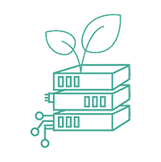

# Welcome to the Green Energy Hub

- [Our Mission Statement](#our-mission-statement)
- [Project Sponsors and contributors](#project-sponsors-and-contributors)

## Our Mission Statement

### Energinet engages with Green Energy Hub in Open Source with a desire to accelerate the green transition

*"The movement must be seen in relation to Energinets vision and strategy, as well as the political ambitions of Europe - in particular the Danish ambitions for 100% renewable energy in the electricity system by 2030 and a climate-neutral society by 2050.*  
*We are continuously working to design, develop, maintain, and expand energy systems, that will make it possible to use renewable energy - nationally and globally.*  
*We want to use digitalization as a way to accelerate a market-driven transition towards a sustainable and efficient energy system, and we will build the foundation for both new market participants and business models through digital partnerships.*  
*We want to create access to relevant data and insights from the energy market and thereby pushing our goals and direction.*  

*We believe that across TSOs, market participants and technology companies, we can support reaching the goals through an open and equal collaboration.*
*Our approach is therefore driven by a strategic belief, that digital development is essential, and societal value creation will follow as we engage and open up.*

*Therefore, we have chosen an approach that we believe best supports our overall vision. We are actively working to maximize value creation both nationally and internationally by choosing a system approach, where we will open up and partner with others to minimize development costs and maximize deployment. We see an opportunity to reduce the cost of software, but also to greatly increase the quality and pace of development through open collaborations. It is a method and approach that we see is increasingly gaining prominence in TSO cooperation.*
*Energinet is not an IT company, and therefore we do not sell systems, services, or operate other TSOs. Our core business is clear, and it must be maintained, but we can contribute to the acceleration of change inside and outside the country, through the methods and tools we use – in this movement we see open source as an important tool.*

*If we can accelerate and disseminate our green digital solutions, we see an opportunity to accelerate the green transition and increase socio economic value creation."*
 

**Martin Lundø, Vice President & CEO of Energinet DataHub, part of the Danish TSO Energinet.**

## Project Sponsors and contributors

 

