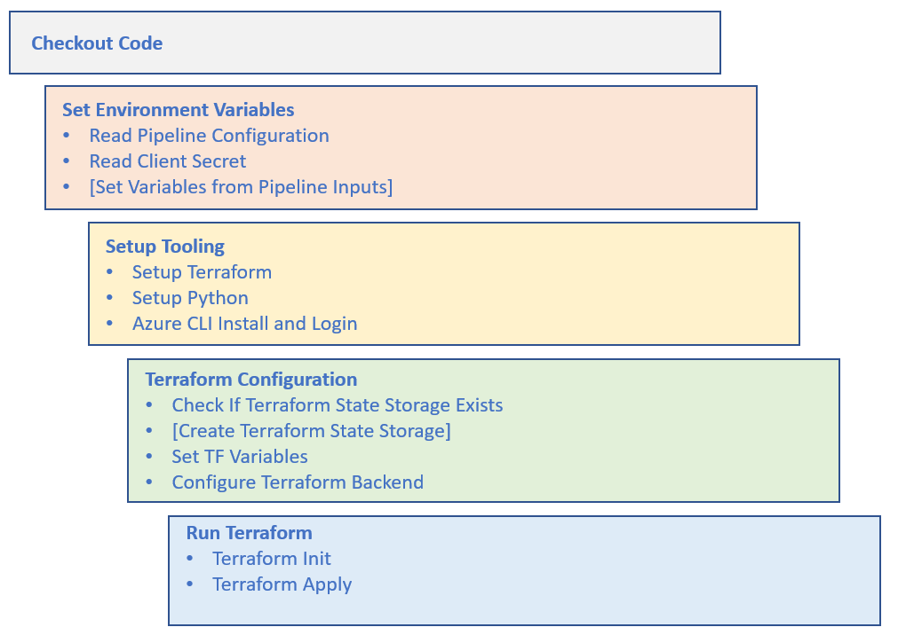
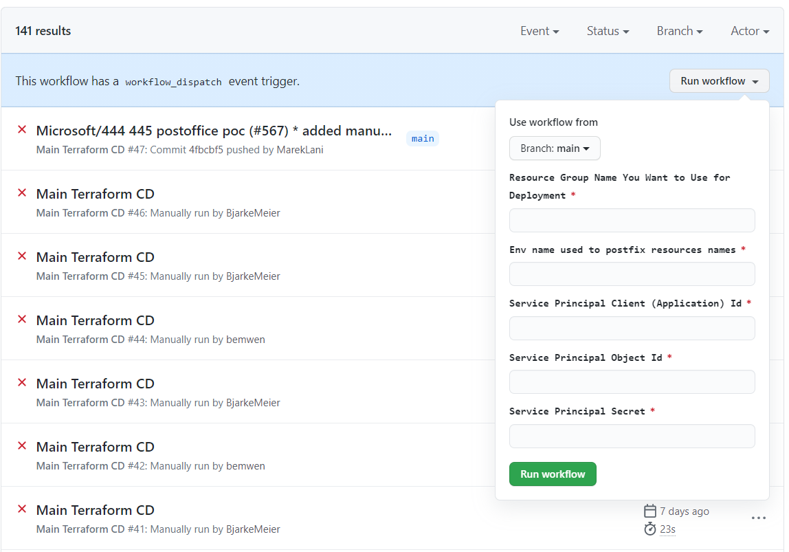
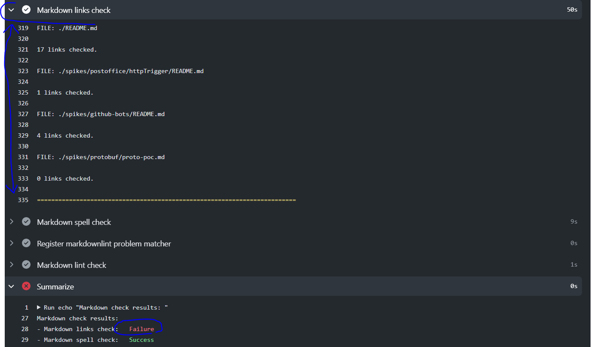
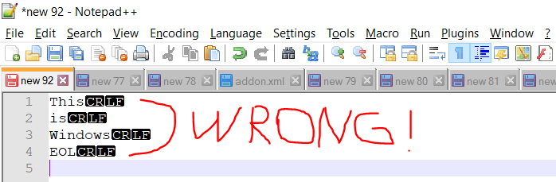
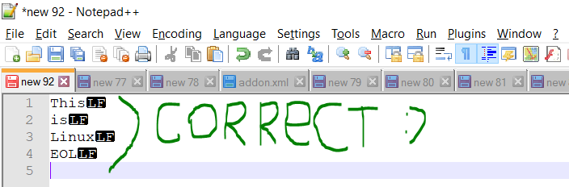
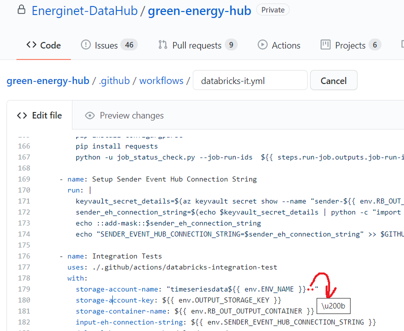

# GitHub Actions - Workflows Documentation

Contents:

- [Infrastructure deployment workflows](#infrastructure-deployment-workflows)
    - [Main Infrastructure Deploy](#main-infrastructure-deploy)
    - [Databricks Aggregation Job Infrastructure Deploy](#databricks-aggregation-job-infrastructure-deploy)
    - [Deploy Databricks Integration Testing Infrastructure](#deploy-databricks-integration-testing-infrastructure)
- [Application Logic Deployment Workflows](#application-logic-deployment-workflows)
    - [Streaming Job Deploy](#streaming-job-deploy)
    - [Building, Testing and Deploying Azure Function Apps](#building-testing-and-deploying-azure-function-apps)
    - [Building, Updating and Publishing Wheel File](#building-updating-and-publishing-wheel-file)
- [Testing Workflows](#testing-workflows)
    - [Databricks Unit Tests](#databricks-unit-tests)
    - [Databricks Integration Tests](#databricks-integration-tests )
- [CI/CD "Tips&Tricks"](#cicd-tipstricks)
    - [Running Workflows During Development](#running-workflows-during-development)
    - [Testing Terraform Locally](#testing-terraform-locally)
    - [Deploying to Custom Environment](#deploying-to-custom-environment)
    - [Manual Trigger/Deployment](#manual-triggerdeployment)
    - [Viewing Markdown Check Results](#viewing-markdown-check-results)
    - [Create or Change Bash Scripts, Terraform or Workflow Files](#create-or-change-bash-scripts-terraform-or-workflow-files)
- [Terraform Documentation Resources](#terraform-documentation-resources)

GitHub Actions workflows which are part of the project contain main building blocks to **deploy solution infrastructure** and **application logic** to Azure environment.
There are also several **testing workflows** which perform unit and integration testing.
Fully automated deployment strategy was not yet implemented however majority of the workflows is set to be invoked both automatically and manually.
Besides workflows responsible for deployments and tests, this repository contains also workflow which helps to keep markdown documentation within some standard of quality by enforcing **markdown spell, lint** and **link checks** - [md-check](../../.github/workflows/md-check.yml) workflow.
There is also [Combine PRs](../../.github/workflows/combine-prs.yml) workflow present, which can be ran manually and combines PRs created by dependabot, which bumps up the versions of libraries and packages used in the project.

**Important note**: there are several features still missing from GitHub Actions while job templates are the most important of them. Once these features are available, it will create space for streamlining the deployment story quite substantially.

All the workflows are stored in [.github/workflows](../../.github/workflows) directory. Below we discuss individual workflows and their key steps.
When reading this document, we strongly encourage you to open workflow files side by side with this documentation.
Also, if you are new to Terraform we encourage you to review [Terraform documentation](#Terraform documentation resources:) referenced at the end of this document.

## Infrastructure deployment workflows

There are several infrastructure deployment workflows, which deploy infrastructure needed to either run the solution or tests.

**Please note**, that in order to prevent introducing possible errors when deploying solution, you should strictly separate changes done to infrastructure setup and application logic into separate branches and PRs.
Reason for that is, that infrastructure and application deployment workflows are currently triggered on push to main branch. If you do change both in one PR, you might risk errors caused by concurrent runs of workflows.

In the following sections we briefly describe infrastructure deployment workflows.

### Main Infrastructure Deploy

[infra-cd.yml](../../.github/workflows/infra-cd.yml)

Main Infrastructure Deploy workflow deploys almost entire infrastructure needed to run the solution spanning Azure Services such as API Management, Azure Functions, Azure SQL Database, Storage accounts, Azure Event hubs, Service Bus Queues, Databricks Workspace, Cosmos DB, Azure Key Vault etc.

Currently this workflow is triggered on push to main branch while there are path filters set as well, to avoid unnecessary rerun if no change was done to the infrastructure setup.
It is also possible to run this workflow manually from GitHub Web environment. Please see [Manual Trigger/Deployment section](#manual-triggerdeployment) for more details on manual deployment.

Workflow contains only one job with the steps which can be placed into several logical groups:



There are several non-trivial steps happening in the workflow:

To allow **deployment into different environments** (to different resource groups using different Azure Service Principal credentials) we needed to introduce approach how to provide and read different configurations.
This approach is described in detail in [Deploying to Custom Environment section](#deploying-to-custom-environment).

In the deployment workflows and not only those used to deploy the infrastructure we make quite heavy use of Terraform.
Basically, in each workflow which makes use of Terraform there are two Terraform related logical groups of steps:

 1. *Terraform Configuration* - when running Terraform on the ephemeral build agent it is important to have permanent state storage, so that Terraform can determine, what resources have been already deployed during previous workflow runs and which resources have been changed or added since the last run.
 For this purpose, we use [*azurerm backend*](https://www.terraform.io/docs/backends/types/azurerm.html) configuration which enables us to store Terraform state inside of Azure Storage Account.
 In comparison to other workflows *Main Infrastructure Deploy* workflow also checks for existence of Terraform State Storage and if needed it creates it.  

    Before Terraform files can be ran, we need to configure Terraform backend used to store the state.
    As we are creating state storage dynamically based on environment name, we also need to configure the backend dynamically.
    Unfortunately, backend configuration does not allow use of variables, so we are using custom GitHub Action which replaces placeholders in backend.tf file for actual values.

    It is eventually possible to provide backend configuration details as parameters for `tarraform init` command, however we have seen problems with this approach when creating Azure Key Vault secrets.
    State was getting corrupted and so we decided to use overstated approach.

    Terraform configuration group of steps contains also step which feeds Terraform input variable values.
    All the environment variables prefixed with '*TF_VAR_*' string created within workflow are forwarded to Terraform environment where they can be read. E.g. *TF_VAR_myvariable* environment variable would be forwarded to Terraform, while inside of Terraform files it can be accessed using *var.myvariable* expression.
    Note that *myvariable* needs to be also defined as Terraform input variable.

 2. *Run Terraform* - This group has two steps `terraform init` and `terraform apply` commands.
    As the names of the commands say, it initializes Terraform environment, installs required providers and apply the changes (deploys resources) specified in terraform files.
    For debug purposes you might add also `terraform plan` command which will display what resources will be modified, deleted, or added.
    When testing new changes introduced to Terraform files, it is also possible to run terraform locally to have quicker feedback loop and avoid unnecessary workflow runs.
    For more details refer to [Testing Terraform Locally section](#testing-terraform-locally).

In order to maximize reuse of Terraform code many resources are deployed using modules. When you navigate to *[build/terraform/infra](../../build/terraform/infra)* folder you will notice quite a long list of Terraform files there.
Besides configuration files (backed.tf, variables.tf, providers.tf) there are files used to deploy resources.
Majority of them however does not define [azurerm Terraform provider resources](https://registry.terraform.io/providers/hashicorp/azurerm/latest/docs) directly, but rather reference modules living in *[build/terraform/modules](../../build/terraform/modules)* folder, which are parametrized and are defining azurerm Terraform provider resources which should be deployed.

To maximize control over resource dependency tree created by Terraform and also to enable specifying dependencies across the Terraform modules there is special approach to set dependencies used.
Each module defines *dependency_getter* and *dependency_setter* [null resources](https://registry.terraform.io/providers/hashicorp/null/latest/docs/resources/resource). *dependency_getter* resource is then used to define dependencies of the resources within the module using their depends_on property.
Below is example from *[event-hub module](../../build/terraform/modules/event-hub/main.tf)*:

   ```yaml
   resource "null_resource" "dependency_getter" {
     provisioner "local-exec" {
     command = "echo ${length(var.dependencies)}"
     }
   }

   resource "null_resource" "dependency_setter" {
     depends_on = [
       azurerm_eventhub.main,
     ]
   }

   resource "azurerm_eventhub" "main" {
     depends_on          = [null_resource.dependency_getter]
     ...
   ```

This causes *azurerm_eventhub* resource to be dependent on *null_resource.dependency_getter* resource, which does not get created until all the resources defined in *dependencies* variable are created. *dependency_setter* resource is used to determine, if all the resource defined in the module where successfully deployed.
If we had multiple azurerm resources defined in the module, it would be dependent on all of them.

Dependency of Azure Event Hub resource on Azure Event Hub Namespace is defined in following way (snippet from [evh-timeseries-inbound-queue.tf](../../build/terraform/infra/evh-timeseries-inbound-queue.tf) file):

   ```yml
   module "evh_inboundqueue" {
     source                    = "../modules/event-hub"
     name                      = "evh-inbound-queue-${var.environment}"
     namespace_name            = module.evhnm_timeseries_inbound_queue.name
     resource_group_name       = data.azurerm_resource_group.greenenergyhub.name
     partition_count           = 32
     message_retention         = 1
     dependencies              = [module.evhnm_timeseries_inbound_queue.dependent_on]
   }
   ```

Notice how the *dependencies* variable refers not only to the event hub namespace module, but rather to its dependent_on property.
This way we can guarantee correct hierarchy of dependency tree in case of multi-level resource dependencies. For instance, Event Hub Auth Rule is dependent on creation of Event Hub which is dependent on creation of Event Hub Namespace.

### Databricks Aggregation Job Infrastructure Deploy

[aggregation-job-infra-cd.yml](../../.github/workflows/aggregation-job-infra-cd.yml)

This workflow should be ran only after main infrastructure was deployed.
It is responsible for copying aggregation job files and wheel files to Databricks File System, creating cluster in Databricks Workspace and installing required libraries to this cluster.
Creation of the aggregation jobs is not a goal of this workflow. Based on the aggregation job scheduling requirements it was decided that aggregation jobs will be started using Databricks API calls.
See more on job scheduling in [guidance](../guidance/scheduling-aggregation-jobs.md) document.

Currently this workflow is also triggered on push to main branch while there are path filters set as well.

Structure of the workflow is similar to previous one with small differences. Similarly, to previous workflow it checks out the code, reads the configuration and installs the tooling onto the agent.
It obtains Databricks Workspace Id and Url as these are required in Terraform and when uploading job files and wheel file, which are uploaded using Databricks CLI, which is installed as part of the tooling.

Workflow subsequently runs Terraform configuration steps (sets Terraform variable and configures backend) and runs `terraform init` and `terraform apply`.
In case of this workflow there is one Terraform file, which defines resources to be deployed - [main.tf](../../build/terraform/databricks_cluster/main.tf) located in *build/terraform/databricks_cluster* directory which deploys cluster into existing Databricks Workspace.
It also defines libraries required by the jobs including wheel file.

Later, number of clusters and their scaling settings might be changed based on the computational needs of aggregation jobs.

Terraform files make use of official [Databricks Terraform resource provider](https://registry.terraform.io/providers/databrickslabs/databricks/latest/docs) and it requires *azure_workspace_resource_id* property to be set (see [build/terraform/databricks_cluster/providers.tf](../../build/terraform/databricks_cluster/providers.tf)).
It is forwarded to Terraform from the workflow as *databricks_id* variable.

### Deploy Databricks Integration Testing Infrastructure

[databricks-integration-testing-infra-cd.yml](../../.github/workflows/databricks-integration-testing-infra-cd.yml)

This workflow deploys infrastructure used for running integration test of stream processing job. Until integration testing strategy is not determined, this workflow is not being triggered automatically.

*Deploy Databricks Integration Testing Infrastructure* workflow deploys only subset of resources deployed in Main Infrastructure Deploy workflow, while some of these resources are deployed in multiple instances.
Reason for that is to enable running of multiple integration tests in parallels without any risk of conflicts and possible test failures due to these conflicts.
Resources that are deployed in multiple instances are Event Hubs, Azure Storage containers and Cosmos DB collections.
Multi instance deployment is achieved using [*count meta argument*](https://www.terraform.io/docs/configuration/meta-arguments/count.html) supported by Terraform.
Bellow you can see example of deployment of multiple Event Hubs and creation of sender auth rule for each of them.
This example is copied from [evh-timeseries-inbound-queue.tf](../../build/terraform/databricks_integration_testing_infra/evh-timeseries-inbound-queue.tf) file.

```yaml
module "evh_inboundqueue" {
  count                     = var.env_count
  source                    = "../modules/event-hub"
  name                      = "evh-inbound-queue-${var.environment}-${count.index}"
  namespace_name            = module.evhnm_timeseries_inbound_queue.name
  resource_group_name       = data.azurerm_resource_group.greenenergyhub.name
  partition_count           = 32
  message_retention         = 1
  dependencies              = [module.evhnm_timeseries_inbound_queue.dependent_on]
}

module "sender_evhar_inboundqueue" {
  count                     = var.env_count
  source                    = "../modules/event-hub-auth-rule"
  name                      = "sender-evhar-inboundqueue-${count.index}"
  namespace_name            = module.evhnm_timeseries_inbound_queue.name
  eventhub_name             = module.evh_inboundqueue[count.index].name
  resource_group_name       = data.azurerm_resource_group.greenenergyhub.name
  send                      = true
  dependencies              = [module.evh_inboundqueue[count.index].dependent_on]
}
```

Notice how *${count.index}* value is used to create unique name of resources.
Also notice how the *[count.index]* value is used in *sender_evhar_inboundqueue*'s *eventhub_name* property to reference correct Event Hub instance.

*Deploy Databricks Integration Testing Infrastructure* workflow runs also two extra additional activities, both related to booking of the resources for integration testing.
First is that besides Terraform State Storage Container it also creates storage container to store *booking state table*. Second step is upload of [the file with default booking state table](../../build/resource-booking-state) which defines what resources can be booked during integration test run.
Resource booking process is described in detail in later part of this document. See [Databricks Integration Tests section](#databricks-integration-tests)

## Application Logic Deployment Workflows

Green Energy Hub solution contains several projects of different types which require different deployment approach and are using different cloud services to be hosted in the cloud.
Thus, the overall solution for deployment of application logic is split into several GitHub Actions workflows discussed below.

### Streaming Job Deploy

[streaming-job-cd.yml](../../.github/workflows/streaming-job-cd.yml)

This workflow deploys and starts *enrichment_and_validation.py* Databricks streaming job. Similarly, as other workflows it checks out the code, reads the configuration and installs the tooling onto the agent.
Then it obtains Databricks Workspace id and url as these are required in Terraform and when configuring Databricks CLI, which is used to upload job and wheel file to Databricks File System.

Besides job and wheel file, workflow downloads alpha version of *CosmosDB connector* package and uploads it to Databricks File System, so it can be referenced as library when creating the streaming job.
These steps won't be necessary once library is officially published to Maven Repository.

Once all prerequisites are deployed to Databricks File System workflow continues with terraform related steps.
It runs Terraform configuration steps (sets Terraform variables and configures backend) and runs `terraform init` and `terraform apply` commands.
For this workflow there is one Terraform file which defines resources to be deployed - [main.tf](../../build/terraform/databricks_streaming_job/main.tf) located in *build/terraform/databricks_streaming_job* directory.
It makes use of [Databricks Terraform provider](https://registry.terraform.io/providers/databrickslabs/databricks/latest/docs) and creates job together with the new cluster definition.
Job definition also references libraries which should be used to run the job.
Job resource created by terraform apply command is "tainted" using `terraform taint` command which means it will be redeployed on each run of the terraform apply.
Reason for doing so, is that Databricks allows to edit the job definition without restarting it and tainting of the job enables to force the recreation of the job.
It has one drawback, however. Each time job is redeployed, job run history is lost.
This workaround should not be needed once there is solution to this Databricks Terraform provider [issue](https://github.com/databrickslabs/terraform-provider-databricks/issues/389) provided.

As it is only possible to create definition of the job and not to start it directly from the Terraform there is custom [*Databricks CLI Run the Job*](../../.github/actions/databricks-cli-run-jobs/action.yml) action used to start the job run.
This action uses *job-id* provided as an output from terraform apply step. Once the job is started workflow runs [Check Job Status](../../build/job_status_check.py) python script, which waits for the job to get into running state.
This check allows n retries of the job so it can overcome possible transient errors.
Note that number of retries in terraform job definition should be equal  to number of retries specified as parameter of job status check script.

### Building, Testing and Deploying Azure Function Apps

[main-pr-gate.yml](../../.github/workflows/main-pr-gate.yml) / [postoffice-http-trigger-cd.yml](../../.github/workflows/postoffice-http-trigger-cd.yml)

These workflows are both related to Azure Functions projects, however both do a bit different thing.
First mentioned *main-pr-gate.yml* workflow defines multiple jobs, while each of them builds and tests different Azure Functions Projects within the repository and subsequently publishes build packages as workflow artifacts.
In the beginning of this workflow there is also license check job defined, which uses [kt3k/license_checker@v1.0.3 action](https://github.com/kt3k/license_checker) to checks for presence of license file based on [*.licenserc.json*](../../.licenserc.json) config file.

The later one *postoffice-http-trigger-cd.yml* also builds the Azure Functions project package, it does not invoke the tests, but it deploys the package into Function App in Azure.
We are discussing both these workflows in detail in [guidance document](../guidance/azure-functions-guidance.md).

Going forward these workflows should be merged into one (or multiple ones per Azure Functions project), which will be testing, building, and publishing the Azure Functions projects into Azure.

### Building, Updating and Publishing Wheel File

[build-publish-wheel-file.yml](../../.github/workflows/build-publish-wheel-file.yml)

Currently wheel file is not being built during each deploy of databricks job, but it is built and published in separate workflow.
This workflow is invoked once the [VERSION](../../src/streaming/VERSION) file located in *src/streaming* repository is changed.
In other words when version is upgraded and when these changes are pushed into main branch.

This workflow checks out the code, reads predefined environment configuration file (currently sandbox.json) and install and logins into Azure CLI.
If it does not exist, this workflow creates Azure Storage Account and Container which should serve as wheel file repository.
Then it builds the wheel file by running `python setup.py sdist bdist_wheel` command and as a last step it uploads the file into wheel repository (storage container).
Version set in VERSION file is used to name the wheel file that was created.

When the new version of the wheel file is created, *WHEEL_VERSION* environment variable needs to be updated in *streaming-job-cd.yml*, *databricks-it.yml* and *aggregation-job-infra-cd.yml* workflows so that new wheel file gets used when running Databricks jobs.
This approach enables wheel file versioning and publishing without immediate need to update all the Databricks jobs to use it, however it is not in line with *GitOps* way of implementing CD processes.

#### Publishing Wheel File with GitOps approach

As wheel file is a library which is essential part of the solution, we might introduce also different approach of building it.
The approach which would version wheel file together with the rest of the code which is dependent on this wheel file using just the git and no additional versioning mechanism.
This means if developer changes part of the logic which ends up in the wheel file, he or she must be sure to alter also other dependent parts of the code (streaming or aggregation job logic), so that the whole solution stays functional.
In this approach package would be built and deployed together with the deployment of Databricks jobs or the other way around, Databricks jobs would be redeployed each time there is change introduced to logic encapsulated in the wheel file.

To determine which of these two approaches is more suitable you need to answer question of whether you want to and need to support multiple versions of the wheel file.
Let's consider situation when you introduce breaking change to the wheel file which fixes some issue within streaming job but might also influence behavior of aggregation jobs.
With GitOps approach you would need to introduce changes to the wheel file logic, streaming job and aggregation jobs and redeploy.
With current wheel file versioning approach, you are able to bump up version of the wheel file used within the streaming job and continue using old version in the aggregation jobs and defer their altering for later.
On the other hand, this approach brings overhead of maintaining the wheel file repository and publishing workflow and also complicates development.

Potentially it is possible to use combination of these two approaches.
For production deployment you can maintain wheel file repository, while for dev purposes there can be separate workflow which would both create and copy the wheel file to Databricks Workspace and deploy the job so that it can be tested with the latest changes done to the wheel file, without need to run separate Wheel File Build and Publish workflow.

## Testing Workflows

There are currently three workflows performing some sort of automated testing.
First - performing unit testing of Azure Functions mentioned in [Building, Testing and Deploying Azure Function Apps section](#building-testing-and-deploying-azure-function-apps) and then there are two other workflows performing unit and integration testing of Spark jobs.

### Databricks Unit Tests

[databricks.ci.yml](../../.github/workflows/databricks-ci.yml)

This workflow runs unit tests of the aggregation jobs and streaming job logic. Unit tests are defined in  [src/streaming/tests](../../src/streaming/tests) directory.

Currently this workflow runs on push to main branch and can be triggered manually as well. Instead of using paths filter workflow is using Skip Duplicate Action.
It is used so that the action can be set as [required check](https://docs.github.com/en/free-pro-team@latest/github/administering-a-repository/enabling-required-status-checks) in branch settings of the repository.
Currently there is limitation of GitHub Actions that path filters cannot be used together with required checks. Skip Duplicate Action enables to overcome this [issue](https://github.community/t/status-check-with-path-filter/18049/8).
Skip Duplicate Action outputs true in case there were no changes to the paths defined in path input field. Subsequently this output value is used in conditions in each step, which determines whether step should be executed or not.

This workflow also runs some static code checks using [TrueBrain/actions-flake8@master](https://github.com/TrueBrain/actions-flake8) action.

After static code checks pass, workflow runs unit tests using [custom databricks-unit-test](../../.github/actions/databricks-unit-test) action.
This action is docker container action. It spins up docker container defined in [dockerfile](../../.github/actions/databricks-unit-test/Dockerfile).
Once the container is started on the agent and all the tooling defined in dockerfile is installed, it runs [entrypoint.sh](../../.github/actions/databricks-unit-test/entrypoint.sh) script, which makes use of [pytest](https://docs.pytest.org/en/stable/) tool to run the unit tests.

As the installation of the tooling which takes place after container is started takes longer time and it prolongs the workflow run, further optimization might be building of unified development Docker Image with all the tooling preinstalled, which would be upload to Docker image repository.
Then this image can be used as base image for Local Dev Container, Unit Testing Container and also Integration Testing container.

### Databricks Integration Tests

[databricks-it.yml](../../.github/workflows/databricks-it.yml)

This workflow executes integration tests of the streaming job ([enrichment_and_validation.py](../../src/streaming/enrichment_and_validation.py)).
Later, when tests scenarios are extended to cover aggregation jobs as well, it can be modified to enable automated testing of those as well.

Prerequisite to run this workflow is that integration testing infrastructure has been deployed using [Deploy Databricks Integration Testing Infrastructure workflow](#deploy-databricks-integration-testing-infrastructure).
Until the integration testing strategy is not determined, this workflow is not being triggered automatically.

First portion of the workflow is very similar to [Streaming Job Deploy workflow](#streaming-job-deploy). Before integration tests of the streaming job can be ran the job needs to be started so that it is ready to start processing incoming messages generated from within the testing logic.

For the needs of resource booking and output validation done in integration test logic, it is necessary to feed the storage credentials into environment variables in *Setup storage credentials step*.

Infrastructure pieces used to run the test case such as event hubs, storage containers and Cosmos DB collections are determined by output of *Resource booking step* which makes use of custom [resource-book action](../../.github/actions/resource-book).
This step queries the [Resource Booking State file](../../build/resource-booking-state) uploaded during testing infrastructure deployment and tries to obtain lock over the resources required to run the integration testing.
It contains *name of the resource*, *lock status* and *group id*. Once the resource is locked (or released) there is fourth column added which contains a unix datetime.
Also, you can specify a *booker id* to identify process, that booked a resource. Below you can see content of the booking table file and details of book resources step.

Booking Resources Table File:

```csv
evhar-inboundqueue-connection-string-0|free|INPUT
evhar-inboundqueue-connection-string-1|free|INPUT
evhar-inboundqueue-connection-string-2|free|INPUT
energinet-docs-container-0|free|COSMOS
energinet-docs-container-1|free|COSMOS
energinet-docs-container-2|free|COSMOS
messagedata0|free|OUTPUT_CONTAINER
messagedata1|free|OUTPUT_CONTAINER
messagedata2|free|OUTPUT_CONTAINER
```

There are several groups of resources stated in resource booking state file. Values in INPUT group refer to key vault secret names which hold connection string to event hub.
Values from OUTPUT_CONTAINER and COSMOS groups refer to storage container name and cosmos db collection name.

Booking Resources Steps:

```yaml
    - name: Book resources for integration test
      id: rb-book
      uses: ./.github/actions/resource-book
      with:
        action: book
        azure-storage-connection-string: ${{ env.BOOKING_STORAGE_CONNECTION_STRING }}
        group: 'INPUT,COSMOS,OUTPUT_CONTAINER'
        state-blob: resource-booking-state
        state-container: it-booking-state
```

*resource-book* action used in resources booking step requires several inputs to be set. Besides feeding storage credentials as inputs, also action and group input parameter needs to be specified.
*action* input can take one of two values: *book* or *release*, to either book or release the resources. *group* input takes in the list of groups of resources, from which the resources should be booked.
Values of resource booking can be read from env variable created by Resource Booking step while this environment variable has following key format - *RB_OUT_{name of the group}*.

As it was already mentioned INPUT group values refer to key vault secret names which hold connection strings to event hubs.
Connection string value itself is obtained by accessing key vault inside of Terraform file.
When constructing the event hub secret name, we use prefix receiver and sender to denote, whether we want to read receiver or sender connection string.
Values from OUTPUT_CONTAINER and COSMOS groups are forwarded to Terraform without any transformation needed.

```yaml
    - name: Set TF Vars
      run: |
        receiver_eh_input_secret_name="receiver-${{ env.RB_OUT_INPUT }}"
        streaming_container_name=${{ env.RB_OUT_OUTPUT_CONTAINER }}
        cosmos_coll=${{ env.RB_OUT_COSMOS }}

        echo "TF_VAR_receiver_eh_input_secret_name=$receiver_eh_input_secret_name" >> $GITHUB_ENV
        echo "TF_VAR_streaming_container_name=$streaming_container_name" >> $GITHUB_ENV
        echo "TF_VAR_cosmos_coll=$cosmos_coll" >> $GITHUB_ENV
        echo "TF_VAR_environment=${{ env.ENV_NAME }}" >> $GITHUB_ENV
        echo "TF_VAR_resource_group_name=${{ env.RESOURCE_GROUP_NAME }}" >> $GITHUB_ENV
        echo "TF_VAR_environment=${{ env.ENV_NAME }}" >> $GITHUB_ENV
        echo "TF_VAR_keyvault_id=${{ steps.obtain-keyvault-id-name.outputs.keyvault-id }}" >> $GITHUB_ENV
        echo "TF_VAR_databricks_id=${{ steps.obtain-db-id-url.outputs.workspace-id }}" >> $GITHUB_ENV
        echo "TF_VAR_python_main_file=${{ env.MAIN_PYTHON_FILE}}" >> $GITHUB_ENV

```

Once Terraform variables are set, workflow continues with deployment of the streaming job.
When it is successfully deployed and started, the event hub sender connection string is fed into environment variable (*Setup Sender Event Hub Connection String step*) and custom [*Databricks Integration Test action*](../../.github/actions/databricks-integration-test) is invoked.

Same as with *Databricks Unit Testing action* also this action is using Docker container defined in [Dockerfile](../../.github/actions/databricks-integration-test/Dockerfile).
This action requires storage and event hub connection credentials to be provided as inputs which are forwarded to Docker container environment and used as parameters for Integration Testing job.
As this container requires more tooling to be installed the building of the container can take over 10 minutes, which again can be shortened by prebuilding the Docker image. Dockerfile specifies [entrypoint.sh](../../.github/actions/databricks-integration-test/entrypoint.sh) script which invokes the [integration test file](../../src/integration-test/streaming-test.py)

After tests are ran, last steps to invoke are deleting of the Databricks streaming job, because otherwise it would run "forever" and to release the booked resources.

To delete the job, workflow is running `terraform destroy` command in the *Terraform Destroy step*. This step is conditional step.
In the step run condition there is [always()](https://docs.github.com/en/free-pro-team@latest/actions/reference/context-and-expression-syntax-for-github-actions#always) expression used in combination with additional condition, which  causes this step to run always in case the streaming job was deployed.
This step will be run even in case workflow run was cancelled just after the streaming job was created. This condition is stated below:

```yaml
if: ${{ always() && steps.terraform-apply.outputs.job-id != '' }}
```

So the previously booked resources can be reused in other runs of the Integration Testing workflow, after Integration Test were finished, booked resources should be released.
It is done in *Release Resources After Integration Test step* by using the resource-book action again. This time with *action input* set to *release*.
This step takes the list of comma separated resources that should be released as an input parameter. This list is provided as an output of the previous resource book action run within the workflow.
Resource release step is also using condition with always() expression combined with additional condition, which checks if the resources were booked.
This way it is guaranteed that the resources will always be released even in case workflow run was cancelled.

```yaml
if: ${{ always() && steps.rb-book.outputs.result == 'True' }}
```

## CI/CD "Tips&Tricks"

In this section we state few tips and tricks related to CI/CD such as testing of workflows during development, deployment of the solution to custom environment, manually triggering workflows and checking markdown linting results.

### Running Workflows During Development

Usually, when doing changes to the workflows which deploy infrastructure or code or which are performing solution tests you might want to run those on push to to your branch to validate, that introduced changes behave as expected.
To do so, you can temporarily enable push trigger for the workflow while including your branch in the branches filter. Potentially you can leave out branches filter entirely during testing.
However, be sure, that before you merge your changes, you set the triggers back to original or another desired configuration.

### Testing Terraform Locally

When opening solution in dev container or on dev machine with Terraform installed, Terraform files can be invoked also locally without need to trigger the workflow.
This is especially valuable when new resources/changes are introduced to the Terraform files and you want to have quick feedback loop to see if changes were constructed correctly.
In such case, you need to do following:

- Configure backend file ( backend.tf ) to either connect to existing storage account where Terraform state is stored, or you can temporarily comment its content out, so Terraform is storing state locally.
Second approach is possible in case of fresh deployment, when no resources where created before.
- Set values for all env variables expected by Terraform files (defined in variables.tf).
- Set ARM_SUBSCRIPTION_ID, ARM_TENANT_ID, ARM_CLIENT_ID, ARM_OBJECT_ID and ARM_CLIENT_SECRET env variables, so that Terraform can authenticate against Azure.
- Run `terraform init` command to initialize working directory.
- Optionally run `terraform plan` command to see what changes will be performed in apply step.
- Run `terraform apply` command to apply changes and deploy resources.

### Deploying to Custom Environment

On the way to the production, it is desired to be capable to deploy and test the solution in different isolated environments.
In Green Energy Hub solution this was enabled by introducing configuration files read from within the workflows. Bellow you can see structure of the configuration file:

```json
{
    "resource_group_name" : "rg-Helpers-D",
    "_comment":"use alphanumerical values for env_name and organisation_name. Together they should not be longer than 7 characters",
    "env_name":"it",
    "organisation_name": "endk",
    "github_secret_name_spn_secret": "RG_HELPERS_D_SPN_SECRET",
    "github_secret_name_spn_object_id": "RG_HELPERS_D_SPN_OBJECT_ID",
    "github_secret_name_spn_id": "RG_HELPERS_D_SPN_ID",
    "github_secret_name_subscription_id": "RG_HELPERS_D_SUBSCRIPTION_ID"
}
```

Configuration file is read in the solution workflows using custom [Read Pipeline Configuration action](../../.github/actions/read-pipeline-configuration/action.yml).
This action feeds values from the file into environment variables.
When using this action, you can provide optional *config-file* input. If this input is not provided, *Read Pipeline Configuration action* will check if there is configuration file named as the branch for which the workflow was invoked.
This enables branch specific configuration files to be introduced. As slashes are not allowed in the names of files, the branch specific configuration file should be named only using substring of the branch name behind the last slash.
So in case your branch is called feature/my-super-feature, the configuration file for the branch should be named *my-super-feature.json*.
If neither config-file input neither branch specific configuration is present action will read default configuration from main.json.

Besides `resource_group_name` and `env_name` and `organisation_name` which are used when creating names of Azure resources within Terraform, configuration file contains also names of the secrets, which hold Azure Service Principal details (besides Tenant Id as there is expectation it will be same for all the environments).
Secrets with provided names should be created within the GitHub repository and should take unique names per each environment. Values of these secrets are obtained in the Set Environment Secret step:

```yml
- name: Set Environment Secrets
  run: |  
    echo "ARM_TENANT_ID=${{ secrets.TENANT_ID }}" >> $GITHUB_ENV
    echo "ARM_CLIENT_ID=${{ secrets[env.GITHUB_SECRET_NAME_SPN_ID] }}" >> $GITHUB_ENV
    echo "ARM_CLIENT_OBJECT_ID=${{ secrets[env.GITHUB_SECRET_NAME_SPN_OBJECT_ID] }}" >> $GITHUB_ENV
    echo "ARM_CLIENT_SECRET=${{ secrets[env.GITHUB_SECRET_NAME_SPN_SECRET] }}" >> $GITHUB_ENV
    echo "ARM_SUBSCRIPTION_ID=${{ secrets[env.GITHUB_SECRET_NAME_SUBSCRIPTION_ID] }}" >> $GITHUB_ENV
```

To summarize, in order to create your own environment, you should do following:

- Create configuration file and feed it with your own values.
- If you are repository admin create specifically named GitHub Repository  Secrets or contact admin to do it for you.
- Run the workflow with automatic trigger to initiate deployment to your environment.

**Note:** GitHub Actions now provide support for [Virtual Environments](https://github.com/actions/virtual-environments), which can simplify deployment into multiple environments.
However currently if you want to use specific environment you need to state it within the workflow file.
So in case you want to deploy to multiple environments, you need to have multiple workflow files, each responsible for deployment to single environment.
Without support for templates, it would mean quite big code duplicity.
We recommend to start using virtual environments once there is support for workflow templates, so the creation of workflow per environment does not result in code duplication.

### Manual Trigger/Deployment

Almost all workflows provide possibility to run them manually - on demand from within the Repository Github Page.
Workflows which deploy infrastructure or code require input parameters specifying environment where the resources should be deployed to be provided.
When running these workflows manually following inputs are required:



When the workflow recognizes, it was invoked manually, it will override environment settings obtained originally from configuration file by inputs provided when manually invoking the run of the workflow.

### Viewing Markdown Check Results

Summarize markdown check step in [md-check.yml](../../.github/workflows/md-check.yml) workflow, which outputs the overall results of all the markdown check steps, does not provide the information of what the errors where in case there have been some.
In order to see the results, you need to open the individual steps to see detailed error message:



Note that Dev Container is setup to support running of the spell check also locally. Please refer to [markdown spellcheck documentation file](../../docs/local-development/markdown-spellcheck.md).

### Create or Change Bash Scripts, Terraform or Workflow Files

During further development of workflows or actions you may find useful to create some bash scripts intended to be ran in workflow. There is a couple of important rules you need to follow:

1. Make sure your script is compatible with Agent OS (at this moment - Ubuntu 16.04)
2. Make sure you are using Linux End-Of-Line format ('\n' instead of '\r\n') to avoid "invalid syntax" error.

    This is an example of wrong EOL:

    

    This is an example of correct EOL:

    

    To change EOL conversion in NotePad++, go to *Edit -> EOL Conversion -> Unix (LF)*
3. Check for hidden symbols, like 'ZERO WIDTH SPACE' (U+200B).
This is not typical issue, but it is hard to find or debug what is going wrong, if \u220b character exists somewhere in script or other files (terraform, workflow, bash).
This character might be introduced into the code when for instance copying code from chat window if IM clients.
    The easiest way to find this issue is to have a look at your file in GitHub commit (VS Code will not display \u200b character):

    
4. Grant executable permission to you script to avoid "not found" or "permission denied" error.
    This can be done using following git commands:

    ```sh
    git add --chmod=+x -- entrypoint.sh #your script path instead of 'entrypoint.sh'
    git commit -m "Added executable permissions to script"
    git push
    ```

5. Check you have empty line at the end of every file.

## Terraform Documentation Resources

- [Terraform documentation landing page](https://www.terraform.io/docs/index.html)
- [Terraform creating modules](https://www.terraform.io/docs/modules/index.html)
- [Terraform input variables](https://www.terraform.io/docs/configuration/variables.html)
- [Terraform azurerm provider](https://registry.terraform.io/providers/hashicorp/azurerm/latest/docs)
- [Terraform azurerm backend](https://www.terraform.io/docs/backends/types/azurerm.html)
