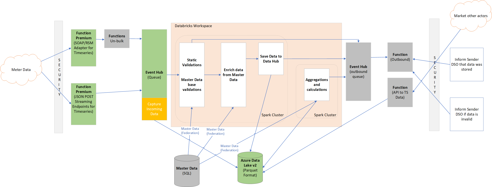

# Calculation Engine Selection

Calculation Engine is the core part of Green Energy Hub solution, responsible for calculating and aggregating individual data points.
Key parts of calculation engine are:

* **Streaming flow** - semi-real time data processing flow executing data enrichment, validation, collection and aggregation.
  Result data is stored into data lake.
* **Aggregation** - daily/monthly batch data processing to calculate business-critical metrics on top of the data collected by real-time flow.
* **Reference data** - daily updated data used to enrich ingested data points.

Preliminary technology decisions:

* **Spark** is the primary choice of calculation engine to implement data processing flows.
* **Delta Lake** is an optional (but recommended) storage layer that brings ACID transactions, time travel, schema enforcement and evolution functionalities to Spark.
* **Azure Event Hub (potentially with Kafka mode)** serves as high-throughput data collection endpoint consumed by Spark engine.
* **Relational SQL Store (Azure SQL Database)** used as relational data store for reference (master) data.

## Technology Options

### Azure Databricks

Databricks is a managed Spark as a Service provider with all configuration and data stored on external to cluster media, while the cluster itself is a pluggable calculation provider that can be disposed or recreated at any moment in time.

Architecture top level view:

* Single Databricks workspace for production and ad-hoc queries.
* Dedicated on-demand auto-scalable clusters for batch jobs, streaming and experimentation.
* Data is stored in parquet format on Azure Data Lake connected to the clusters.
* Applications are notebooks (.scala/.py files) running automatically cell-by-cell.
* Streaming and batch processing are preconfigured Databricks jobs running on dedicated clusters.
  Databricks Workspace provides scheduling.
* Data duplicates and updates are stored "as-is" in append-only format and then filtered during the first stage of processing and aggregation queries.
* Data federation (connection to external storage) is used to copy reference data into memory of spark job.
  Streaming job is restarted daily to update reference cache.

Below is the architectural diagram for this option:

### Azure Databricks with Delta Lake

Delta Lake is an additional feature of Databricks solution that brings ACID transactions, read-time optimizations through primary indexes, time travel, schema enforcement and evolution functionalities.
Databricks adds additional performance optimizations for Delta Lake scenarios.

Architecture top level view:

* **Same as for Azure Databricks**
* Transaction and time-travel features are used for storing data in "snapshots": current state is available by default, but additional query parameters can be used to restore state to a specific point in time.
  It also means the existing data can be altered by incoming updates, thus updates are not necessarily applied only in append format.
* Primary index is set to conform to the most common data partitioning and ordering through aggregation queries.

### Apache Flink

Flink is a lower-level (compared to Spark) stateful streaming engine.
Compared to Spark, which was originally built for batch and then extended for streaming, Flink was built originally for streaming and then extended for batch processing.

Architecture top level view:

* No managed services on Azure, Flink requires either Kubernetes or VMSS deployment.
* Connection to Event Hub in Kafka mode through DataStream connector.
* Applications are prebuilt jar/python applications deployed to the cluster.
* Streaming and batch processing use internal Flink scheduling and recovery mechanisms.
* SQL Master data can be imported through JDBC Table connector.
* Data duplicates and updates are stored "as-is" in append-only format and then filtered during the first stage of processing and aggregation queries.
* Flink has its own serverless implementation allowing to compose app as a set of related small functions.

### Azure Synapse

Azure Synapse is basically next generation of Azure SQL Data Warehouse and unites modern data warehousing under a single technology: Spark for Big Data processing and aggregations + multi-node SQL Server for ad-hoc queries and reporting.

Architecture top level view:

* Single Synapse workspace for relational and Data Lake processing.
* On-demand auto-scalable Spark cluster for batch jobs, streaming and experimentation.
* Data is stored in parquet format on Azure Data Lake.
  Delta Lake provider is preconfigured.
* Applications are jar/python/.NET applications deployed to the cluster.
* Streaming and batch processing are preconfigured on Synapse level as jobs.
* Delta Lake is preinstalled, so Delta Lake specific features from above are available as well.
* External SQL connection is used to copy reference data into memory of spark job.
  Streaming job is restarted daily to update reference cache.

### HDInsight cluster

HDInsight is a fully-featured _provider-agnostic_ Hadoop/Spark distribution that comes at the cost of much bigger management and support overhead.

Architecture top level view:

* Single or multiple HDInsight clusters to hold the whole infrastructure with configuration.
* Data is stored on Azure Data Lake connected to the cluster nodes.
* Applications are jar/python applications deployed to the cluster.
* Real-time spark application managed with YARN, Batch processing is organized through cron jobs.
* Data duplicates and updates are stored "as-is" in append-only format and then filtered during the first stage of processing and aggregation queries.
* Delta Lake can be installed as a library to all cluster nodes, so Delta Lake specific features from above are available as well.
* Data federation (connection to external storage) is used to copy reference data into memory of spark job.
  The streaming job is restarted daily to update reference cache.

### VMSS/Kubernetes Spark

VMSS/Kubernetes approach provides a way to deploy fully-managed open-source Spark Cluster at the price of cluster administration burden.

Architecture top level view:

* **Same as for Azure HDInsight** with requirement to install and configure the whole spark instance.

### Serverless for data enrichment/validation

Azure Functions is a serverless technology that can be used for per-item data operations.

Architecture top level view:

* This option is limited to per-item processing with per-collection operations left to Spark processing.
  Otherwise, it will have too large development overhead.
* Denormalized reference data is cached with Redis for quick access by Azure Functions.
  Additional effort is needed to keep cache in up-to-date state.
* Function listens for new messages in input event hub.
  On every message it queries Redis cache by id, enriches and validates data, and stores result in parquet format in Data Lake/another interim event hub.
* Scalability target/limits of Premium Azure Functions should be validated for that use case.

## Partial architecture extensions

### Azure Time Series Insights

Azure Time Series Insights (TSI) offers near real-time data exploration and asset-based insights over historical data.
It is ideal for ad-hoc data exploration and operational analysis.
It also offers visualization engine for time series data, that can be used for aggregations, diagnostic and limited querying.

Architecture top level view:

* TSI can be connected to either input or output event hubs.
* Underlying Data Store of Time Series insight can be used from Databricks or other processing engine
* UI is used for ad-hoc time series analysis, exploration and diagnostics

### Azure Data Explorer

Azure Data Explorer is quick real-time  exploration engine build originally for complex ad-hoc queries on large volumes of telemetry data and logs.
Query can be used to explore and visualize time series data through an extensive query language suitable for data exploration.

Architecture top level view:

* Data Explorer can be connected to either input or output event hubs.
  Reference data and other data sources can also be exported on a daily basis.
* SDK can be used to output query results to other parties.

### Azure Synapse (SQL Data Warehouse)

Azure Synapse (Azure Data Warehouse) is an analytical exploration engine build for hot relational big data processing ready for terabytes of data.
Azure Synapse can be used to explore aggregated data through SQL query language.

Architecture top level view:

* Data to Azure Synapse SQL should be ingested either by Spark output or Data Factory from Data Lake.
  Reference data and other data sources can also be imported on a daily basis.
* OLEDB/ODBC can be used to output query results to other parties.
