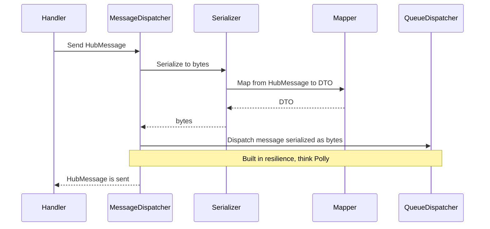
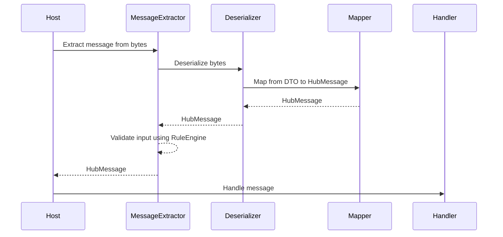

# ADR0003 Inter-service communication

* Status: accepted
* Deciders: @MartinFHansen, @renetnielsen, @MrDach, @kft, @sondergaard, @erduna, @Korgath, @Christian-Meyer, @cmgrd
* Date: 2021-01-26

Technical Story: [description | ticket/issue URL] <!-- optional -->

## Context and Problem Statement

We need alignment on contracts between services and verification on the receiving end.
We also need to separate concerns of input validation, serialization, mapping and transport layer.

## Decision Drivers <!-- optional -->

* We used an unhealthy amount of time debugging inter-services communication.

## Considered Options

* Protobuf
* Open API
* nuget shared C# Dtos

## Decision Outcome

We will expand on the GreenEnergyHub.Messaging framework with better separation of concerns, and in DataHub, we'll use Protobuf. This will give us clear contracts that'll work across tech stacks and give us an added performance bump with the downside of messages not being human-readable.

### Positive Consequences <!-- optional -->

We can use protobuf and strong contracts. Additional it will be easy to change/override:

* serialization
* mapping
* queue

### Negative Consequences <!-- optional -->

More work up front but less work down the line.

## Pros and Cons of the Options <!-- optional -->

### Protobuf

[docs](https://developers.google.com/protocol-buffers/)

* Good, because it offers clear language/platform agnostic contracts.
* Good, because it's more performant than the text based solutions, both in size and speed.
* Bad, because it's not human readable.

### Open API

[docs](https://swagger.io/specification/)

* Good, because it's the standard way of documenting open apis.
* Bad, because it doesn't play well with azure functions.
* Bad, because it requires alot of boilerplate (swagger) code to in most cases document a single endpoint vs. Traditional API's with alot of endpoints

### nuget shared C# Dtos

* Good, because it's simple.
* Bad, because it's not cross language/platform friendly.

## Notes

### Sending messages

### Receiving messages

