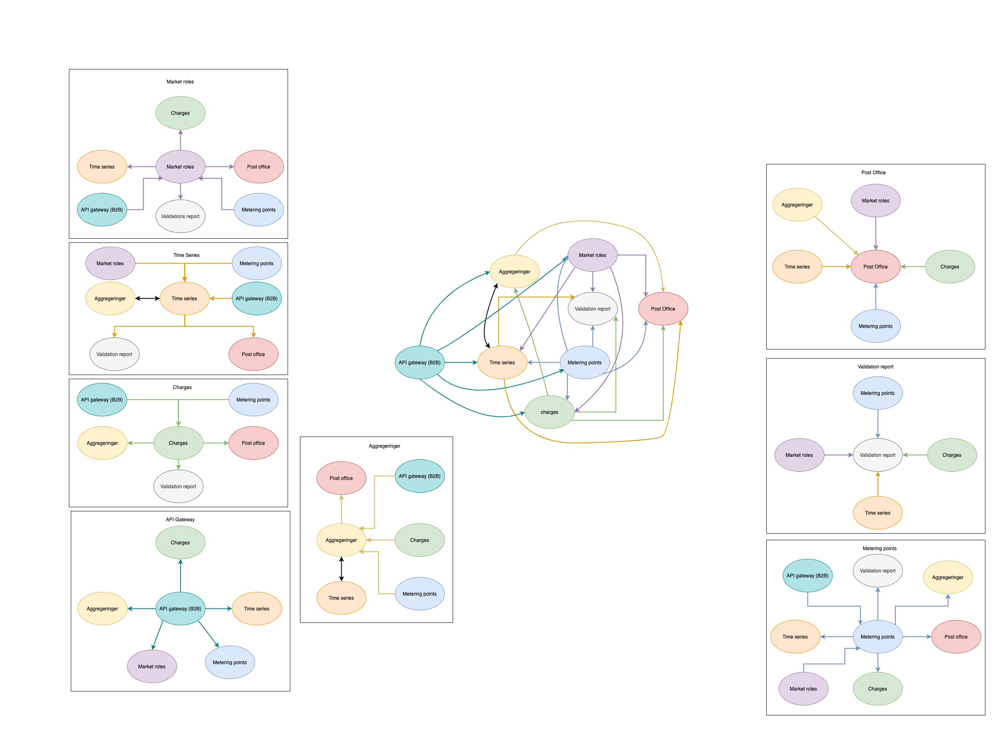

# Getting started

- [Introduction](#introduction)
    - [Bounded contexts](#bounded-contexts)
    - [Relevant links](#relevant-links)
- [Setting up a domain](#setting-up-a-domain)
    - [Prerequisites](#prerequisites)
    - [Forking a domain](#forking-a-domain)
    - [Setting up an environment](#setting-up-an-environment)

## Introduction

Below you will find a thorough explanation on how to get started using the Green Energy Hub.
The outcome of this documentation should make you able to setup any domain inside the Green Energy Hub.

### Bounded contexts

Each domain consists of a boundex context. Below is a visual representation of these.

### Relevant links

To be able to understand some of the aspects of this guide, we encourage you to read the links below.

- Github
    - [Fork a repo](https://docs.github.com/en/github/getting-started-with-github/fork-a-repo)
    - [Environments](https://docs.github.com/en/actions/reference/environments)
    - [Github actions](https://github.com/features/actions)
- Terraform
    - [Intro](https://www.terraform.io/intro/index.html)
    - [Azure Provider](https://registry.terraform.io/providers/hashicorp/azurerm/latest/docs)
- Azure
    - [Azure Subscription](https://azure.microsoft.com/en-gb/free/)
    - [Azure Resource Group](https://docs.microsoft.com/en-us/azure/azure-resource-manager/management/manage-resource-groups-portal)
    - [Azure Service Principal](https://docs.microsoft.com/en-us/azure/active-directory/develop/app-objects-and-service-principals)

## Setting up a domain

All domains is created using the same domain template, which means that the following approach to setting up a domain, can be used on all domains in the Green Energy Hub.

### Prerequisites

To begin setting up a domain, you will need to do the following:

1. Create a Github Organisation
2. Create an Azure Cloud Environment
    1. Create an active `Azure Subscription`, see [Azure Cloud Environment](https://azure.microsoft.com/en-gb/free/).
    2. Create an `Azure Resource Group` located inside the above subscription.
    3. Create an `Azure Service Principal` including a secret that has access to deploy to the above resource group.
3. Get a hold of a team that is experienced in the following technologies
    - Azure Cloud
        - `Azure DataBricks`
        - `Azure Function App`
        - `Azure Storage Account`
        - `Azure Cosmos DB`
        - `Azure Service Plan`
        - `Azure App Service`
        - `Azure Application Insights`
        - `Azure KeyVault`
        - `Azure Event Hub`
        - `Azure Event Grid`
        - `Azure Service Bus`
        - `Azure Shared Dashboard`
        - `Azure SQL Server`
        - `Azure SQL Database`
        - `Azure CDN`
        - `Azure API Gateway`
        - `Azure Active Directory`
    - `Terraform` with the `Terraform Azure Provider`
    - `.NET 5+`
    - `Python`
    - `Github Actions` (CI/CD)
    - `Git`
    - `Github`
    - `Github Markdown Language`

### Forking a domain

Once you have selected a domain to setup, start by forking it into your own organisation.

### Setting up the cloud environment

Each domain is reliant on having a cloud environment that it can deploy both infrastructure and code into.

Therefor the first thing we need to do is setup the environment for a domain.
To do this please follow these steps (Please read the list of references in the [Relevant links](#relevant-links)).

1. Create an Azure Subscription
2. Create a resource group inside the subscription
3. Create a Service Principal that can be used to deploy into the resource group.

### Setting up the github environment

Now that we have a cloud environment, we are ready to deploy our infrastructure and code into this.
To be able to this we need to configure an environment in github. (Please read the list of references in the [Relevant links](#relevant-links))

All domains is dependent on a having a github environment with a corresponding set of secrets.
The secrets each domain needs can be found in the file located at `docs/environment-secrets.md` in each domain.
