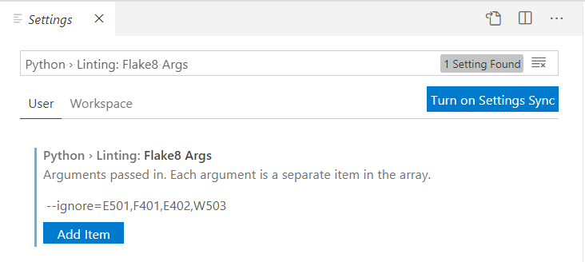

# Configuring Visual Studio Code to use Flake8 static checks in VS Code

This article will help you to deal with Databricks CD workflow by automatically highlight flake8 issues in VS Code Editor.

You can follow [this](https://code.visualstudio.com/docs/python/linting) article to read complete guidance about configuring Linting in VS code. But now we will focus on Python Flake8.

Follow this steps to enable Flake8 checks in VS Code editor and add required exceptions.

1. Open the Command Palette (Ctrl+Shift+P) and select the **Python: Select Linter** command

2. Choose **flake8** from the list of proposed linters. Enabling a linter can prompts you to install the required packages in your selected environment for the chosen linter.

3. In VS Code go to *File -> Preferences -> Settings*.

4. In a search box type: *Python › Linting: Flake8 Args*.

5. Click "Add item" button and add the following string: *--ignore=E501,F401,E402,W503*

6. Click "OK" and you are done.

