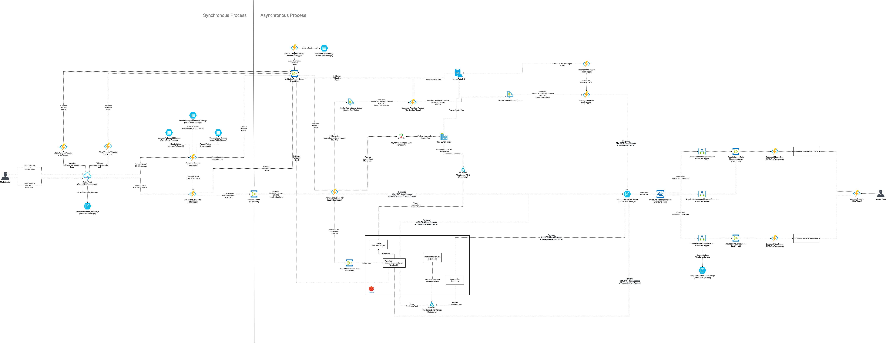
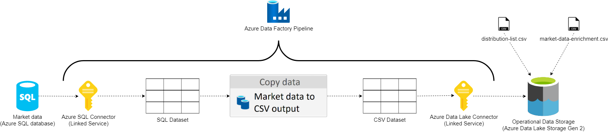

# Design of Data synchronizer in Data Factory for Operational Data Storage

## Context

When Green Energy Hub processes time series in Databricks, access to various types of market data is needed. According to the architectural diagram (see next section) the market data are stored in a SQL Server database. Likewise the architecture diagram show that throughout the system market data are accessed from three different Operation Data Stores (ODS). The present document concerns the design of the Data Synchronizer that will populate the architecture's three ODSs. This documents focuses on two of the ODSs: Market data and Distribution list.

## Architectural area

In this document we are addressing the following components in the architecture:

- MarketData DB, the SQL database storing the market data.
- The Data Synchronizer, which is an Azure Data Factory service.
- The MarketDataEnrichment ODS, realized by one or more CSV files stored in a Data or Delta Lake.
- The DistributionList ODS, which is a CSV file stored in a Data or Delta Lake.

## Basic concept

Azure Data Factory is a data integration service for developing ETL (extract, transform, load) processes. Concretely in Green Energy Hub Data Factory will be used to replicate data from two Views in the SQL Server into corresponding files that are stored in a Lake.

The Market data are stored in a relational data model, where the data needed by the time series processing engine are normalized and distributed across a number of entities. Views stored in the database performs the SELECT statements that extracts the data and denormalizes them. The data in the ODSs are denormalized so that the time series processing engine can read and use them in a perform manner.

## Iterations of ODS development

### MVP solution

One CSV file will be produced per ODS. On each trigger a CSV file will be upserted in a Data Lake with data selected from the SQL view. Following the upsert operation, a ODS CSV file's metadata (including timestamp) will have changed. Using the timestamp, Databricks will be able  to determine if new market data are available. A problem with the MVP solution is the risk that the Data synchronizer updates an ODS file while the streaming job reads it into memory causing inconsistency in the ODS file's state.

### Update to Delta Lake

Delta Lake is an open-source layer that can be applied on top of the Azure Data Lake. Delta Lake brings ACID capabilities to a Data Lake. Use of Delta Lake (which requires a Databricks workspace) will ensure that the time series processing engine is only able to read the market data and the distribution list with consistent states.

From the descriptions above, the efforts to implement the MVP vs Delta Lake solutions may seem quite small. However, there are a couple of reasons for adopting both of them in turn:

- From a previous story (ADO #104381 spike on hands-on experience with Data Factory) the team have a POC of the MVP solution, meaning that the effort to have a running solution is limited.
- Changing the ODS storage to Delta Lake require changes to the streaming job on how the market data are read.

### One ODS file per market evaluation point

In the two previous ODS implementations one CSV file is produced for the Market data ODS and one CSV file is produced for the Distribution list ODS. Therefore a further improvement to the ODS solution will be to create one file per market evaluation point.

When the streaming job updates its data from ODS (happens every five minutes) this solution will enable the streaming job to read a smaller amount of new market data into memory. A ODS file will only have been upserted, if the market data of a specific market evaluation point have changed since the last execution of the Data synchronizer.

Before starting to work on this solution an investigation have to be done to determine if and how the streaming job can be updated to perform only partial ODS data updates.

## Data synchronizer pipeline in Azure Data Factory

The Data synchronizer will be implemented with the Azure Data Factory service. The diagram below show the design to be implemented:

The Data synchronizer will contain two pipelines in Azure Data Factory. From a component point-of-view they will be similar, but each of them will be responsible for extracting separate data from Azure SQL database and store separate files in Data Lake.

The focal component of the Data Factory pipeline is the Copy data activity. This activity will, based on a data set using a linked service (Data Factory's analog to a connection string), extract data from a Azure SQL database. The data are extracted using a View, which is a virtual table constructed from a SELECT statement.

The extracted data will be mapped to another data set describing the data format of the CSV file. Using a linked service to a Data Lake, the Copy data activity will store the upserted CSV file.

The pipeline as shown and described above is based on the ODS MVP solution. The only changes necessary when moving to the Delta Lake based ODS, is to change the CSV data set to a Delta Lake data set and use a Delta Lake linked service instead.

This design document does not go into details of how the pipeline should look for the "One ODS file per market evaluation point", but on a high level, it will likely be more complex a the Data synchronizer in this case will need to perform a transformation of the extracted data, so that they can be split into separate CSV files.
