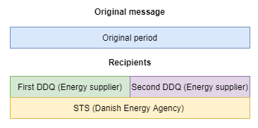

# Usage of the distribution list

## Context

When GreenEnergyHub receives a time series containing several points covering a specific period, this information needs to be forwarded to relevant parties.

This document describes the usage of a distribution list that can be used in the streaming portion of our architecture to determine which market participants the information should be forwarded to.

## Architectural area

In this document, we will be addressing the data synchronizer, the distribution list ODS, the validation/enrichment notebook of the databricks streaming pipeline.

## Basic concept

Since handling the time series information is part of the streaming process inside Databricks, we want databricks to be easily able to fetch a list of recipients into memory that can be used to determine who should receive the information about the points in the time series when it is handled in the spark job.

For this purpose, a list of relationships between market evaluation point groups and market participants will be kept in the Operational Data Storage.

The list will be generated continuously when involved master data change and will be read into memory of databricks with some frequency (starting at every 5 minutes), either triggered by the change itself or with some frequency.

## Maintaining master data

The following master data will be involved in generating the distribution list:

* Market Evaluation Points
* Market Evaluation Point Groups
* Market Participants
* Associations between market evaluation points and market evaluation point groups
* Relationships between Market Evaluation Point Groups and Market Participants

## Data synchronizer

It will be the responsibility of the data synchronizer to make sure a CSV file containing these relationships will be made available at the Operational Data Storage.

When a change is detected the data synchronizer will gather enough information to be able to generate a distribution list containing information about the relationships between market evaluation points and market participants.

The generated list will then be published on the distribution list ODS.

For ease of use the distribution list will not contain information about market evaluation point groups but instead contain a mapping of active relationships between market evaluation points and market participants and the period of the relationship.

## Distribution list ODS

The distribution list Operational Data Storage is responsible for hosting the CSV file generated by the data synchronizer.

It does not otherwise participate actively in the process.

The CSV file generated by the ODS must use a medium supporting ACID-properties (Delta Lake does this) to make sure that a reader of the data does not actually receive inconsistent data. Besides making sure the data is consistent, the ACID properties of the medium will also make it possible to use the timestamp of the file to determine the versioning of the data contained within the file making it possible for readers to determine whether new data is available without actually reading the data itself.

## Validation/Enrichment job

As part of the streaming process of the time series, the validation and enrichment job will determine which recipients should receive this information so this data can be made available for later processing.

The job will fetch the distribution list from the ODS and use this information to figure out which parts of a time series should be made available to what recipients.

For a single processed time series, there might be multiple recipients for the full period of the time series or even partial coverage.

For example, there might have been a change of supplier during the period covered by the time series. In that case some of the period should go to one recipient while the rest should go to another recipient (green and purple areas of the above drawing)

In addition, some time series should be sent to multiple recipients based on the master data. This could for example be the Danish Energy Agency which in some cases need a copy of the information.

The databricks job will use the distribution list made available on the ODS to determine which recipients should receive the information and for what periods.
