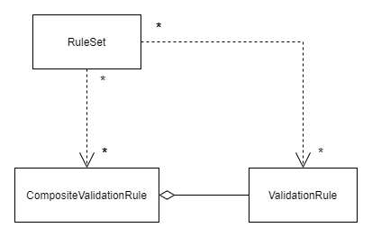

# Validation

When a system is in operation the data it acts upon needs to be validated. This can be divided into three levels.

- Structure of the input data (Syntactic check)
- Are values in the correct format, check digits etc. (Semantic check)
- Domain validation – is the request/actor allowed to enact state changes on the system

## Overall requirements

Each level needs to be executed in isolation. The order of execution is

- Structure validation
- Input-value validation
- Domain validation

If one or more validation rules fails within a level the logic should not proceed to the next level.

Each rule should have a unique name so that it is easy to identify which rule is violated.

### Structure validation

When a component receive a request it should perform a structure validation on the input if it is possible.

This can often be achieved with schema validation, eg. xml-schema, json-schema.

### Input-value validation

At this stage the component have constructed a `DTO` based on the input data. The values of the `DTO` is to be validated to ensure that the input values are conforming to the requirements.

Eg.:

- MeteringPointId is not null or empty
- MeteringPointId is 18 digits in length
- MeteringPointId has a valid check digit

All validations can be performed without doing any lookup in databases or other external data-sources.

A validation rule is not created for a specific `DTO`, but rather defined to work on any object with certain characteristics. Different rules can be combined into a composite which can the be reused across `DTO`.

Since a semantic validation rule is `DTO` agonistic there is a need to combine validation rules. Combined rules are grouped in a `RuleSet` that is created per `DTO`. When a `RuleSet` is executed all rules must be checked.

### Domain validation

The system is modelled after Domain Driven Design principals. DDD has a concept of an `Aggregate Root` that is responsible for ensuring that the system is in a consistent state. Each `Aggregate Root` would supply a validate method that can report if an `Aggregate Root` is capable of performing the request.
