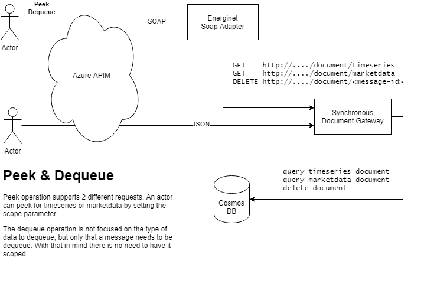

# Synchronous Document Gateway

## Motivation

Market actors must be able to retrieve documents, including acknowledgments, from the DataHub.

It must be possible to retrieve either timeseries or market data documents via JSON HTTP endpoints. It must also be possible to retrieve either document type via SOAP to support the existing way of communicating in the Danish Electricity Market.

## Architecture



## Description

In our implementation we will have two different endpoints. The Green Energy Hub has a JSON (CIM) entrypoint and the Energinet specific adaptation has a SOAP entrypoint as well via the SOAP Adapter.

- The Adapter can handle Peek and Dequeue via two new handlers.
- The `Document Gateway` has three HTTP triggers:
    - GET timeseries
    - GET market data
    - DELETE document
- The `Document Gateway` has handlers corresponding to each of those triggers.
- The documents are to be stored in a CosmosDB.

### EBIX messages (Adapter)

> Peek

*Request*:

```xml
<SOAP-ENV:Envelope xmlns:SOAP-ENV="http://schemas.xmlsoap.org/soap/envelope/">
  <SOAP-ENV:Body xmlns:xsd="http://www.w3.org/2001/XMLSchema" xmlns:xsi="http://www.w3.org/2001/XMLSchema-instance">
    <PeekMessageRequest xmlns="urn:www:datahub:dk:b2b:v01"/>
  </SOAP-ENV:Body>
</SOAP-ENV:Envelope>
```

*Response*:

```xml
<SOAP-ENV:Envelope xmlns:SOAP-ENV="http://schemas.xmlsoap.org/soap/envelope/">
   <SOAP-ENV:Body>
      <ns0:PeekMessageResponse xmlns:ns0="urn:www:datahub:dk:b2b:v01">
         <ns0:MessageContainer>
            <ns0:MessageReference>2c8884f3578b4cf49a5f88563063e639</ns0:MessageReference>
            <ns0:DocumentType>ConfirmChangeOfSupplier</ns0:DocumentType>
            <ns0:MessageType>XML</ns0:MessageType>
            <ns0:Payload>
               <ns0:DK_ConfirmChangeOfSupplier xmlns:ns0="un:unece:260:data:EEM-DK_ConfirmChangeOfSupplier:v3">
                  <ns0:HeaderEnergyDocument>
                     <ns0:Identification>711bf884f1ee49ebbbaf26fe60d87725</ns0:Identification>
                     <ns0:DocumentType listAgencyIdentifier="260">414</ns0:DocumentType>
                     <ns0:Creation>2020-12-17T13:40:37Z</ns0:Creation>
                     <ns0:SenderEnergyParty>
                        <ns0:Identification schemeAgencyIdentifier="9">5790000000000</ns0:Identification>
                     </ns0:SenderEnergyParty>
                     <ns0:RecipientEnergyParty>
                        <ns0:Identification schemeAgencyIdentifier="9">8100000000000</ns0:Identification>
                     </ns0:RecipientEnergyParty>
                  </ns0:HeaderEnergyDocument>
                  <ns0:ProcessEnergyContext>
                     <ns0:EnergyBusinessProcess listAgencyIdentifier="260">E03</ns0:EnergyBusinessProcess>
                     <ns0:EnergyBusinessProcessRole listAgencyIdentifier="260" listIdentifier="DK">DDQ</ns0:EnergyBusinessProcessRole>
                     <ns0:EnergyIndustryClassification listAgencyIdentifier="6">23</ns0:EnergyIndustryClassification>
                  </ns0:ProcessEnergyContext>
                  <ns0:PayloadResponseEvent>
                     <ns0:Identification>268e50b0cdc54b2484fbe95aa4708760</ns0:Identification>
                     <ns0:StatusType listAgencyIdentifier="6">39</ns0:StatusType>
                     <ns0:MeteringPointDomainLocation>
                        <ns0:Identification schemeAgencyIdentifier="9">578030100000000000</ns0:Identification>
                     </ns0:MeteringPointDomainLocation>
                     <ns0:OriginalBusinessDocument>TransId-2020-12-17-14-37-16.689</ns0:OriginalBusinessDocument>
                  </ns0:PayloadResponseEvent>
               </ns0:DK_ConfirmChangeOfSupplier>
            </ns0:Payload>
         </ns0:MessageContainer>
      </ns0:PeekMessageResponse>
   </SOAP-ENV:Body>
</SOAP-ENV:Envelope>
```

> Dequeue

*Request*:

```xml
<SOAP-ENV:Envelope xmlns:SOAP-ENV="http://schemas.xmlsoap.org/soap/envelope/">
  <SOAP-ENV:Body xmlns:xsd="http://www.w3.org/2001/XMLSchema" xmlns:xsi="http://www.w3.org/2001/XMLSchema-instance">
    <DequeueMessageRequest xmlns="urn:www:datahub:dk:b2b:v01">
      <MessageId>MsgId-datahub--20120910-131338.0568</MessageId>
    </DequeueMessageRequest>
  </SOAP-ENV:Body>
</SOAP-ENV:Envelope>
```

*Response*:

```xml
<SOAP-ENV:Envelope xmlns:SOAP-ENV="http://schemas.xmlsoap.org/soap/envelope/">
   <SOAP-ENV:Body>
      <ns0:DequeueMessageResponse xmlns:ns0="urn:www:datahub:dk:b2b:v01"/>
   </SOAP-ENV:Body>
</SOAP-ENV:Envelope>
```

### CIM JSON messages (Document Gateway)

> Peek, both timeseries and market data

*Requests*:

These requests won't have a body but instead, rely on the path entirely.

```HTTP
GET /document/timeseries
GET /document/marketdata
```

*Responses*:

The body/payload will differ based on the actual document retrieved. If a document exists, it will be returned with a `200 OK`. If no document exists a `204 No Content` will be returned.

> Dequeue

*Request*:

```HTTP
DELETE /document/<id>
```

*Responses*:

Response code `200 OK` for successful dequeues.

For unsuccessful dequeues:

- `400 Bad request` if the request isn't correctly formed.
- `401 Unauthorized` if the client doesn't have authorization to dequeue the specified document.
- `404 Not found` if the `id` is not recognized.

## Related modules

This module is closely related to the `DocumentGenerator`, which is again closely related to the `MessageTimerTrigger`. The `DocumentGenerator` generates and saves documents based on system events like processed actor requests or other types of (scheduled) work. The `Document Gateway` can then serve these documents for the market actor.

## Setup and configuration

TBD

## Remaining work

### Open questions

- I renamed the "Message Shipper" to "Document Gateway", I think it's better, but not much. What should it be named?

### Known issues/risk

- Returned messages should at some point be bundled, we shouldn't make a solution that makes that impossible.
    - For now the outbound message size limit is 50 MB for the Danish Market
- We don't know how to do authorization. That might impact how we should implement parts of this feature.
