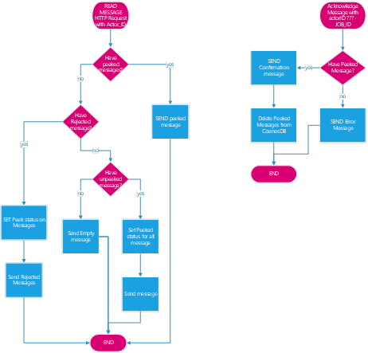

# PostOffice functions

- `Peek` (actor_ID): Send messages for actor_ID ordered by meter_ID and
 Observation time. The function always send the old messages until the
 actor_ID acknowledge them (using dequeue function). Every run the function
 is prioritized to send only messages in the correct sequence. First send
 unacknowledged message (if any), then check for rejected and send it (if
 any) and finally send new unpeeked messages. This function uses stored
 procedures in CosmosDB: `BulkPeek` (retrieve the messages and set the
 correct peeked status), `BulkPeekRejected` (for rejected message) and
 `BulkDelete` to remove old and unnecessary messages.

- `Dequeue` (actor_ID,Job_ID): To be invoked to acknowledge the received
 messages from the actor_ID. When called the function removes all the message
 in CosmosDB for that job_id and permit the actor_ID to make a new request
 for data.

Workflow:

